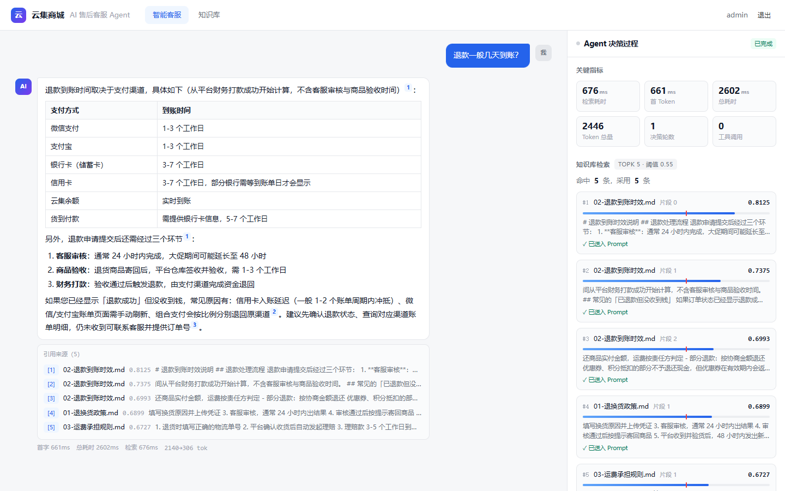
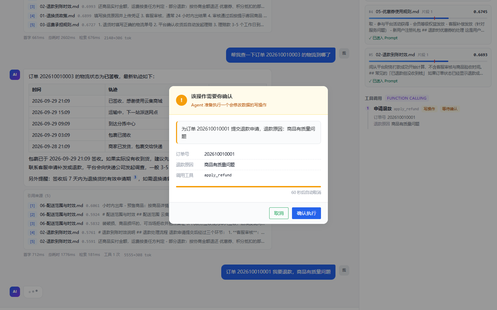

# AI 电商客服 Agent

基于 **RAG 检索** + **Function Calling** 的电商售后客服智能体。既能依据平台政策回答问题，
也能真实调用工具查订单、查物流、提交退款、修改收货地址，并把 Agent 的完整决策过程实时可视化。

围绕它做了两件通常被忽略的事：

1. **决策过程可观测** —— 检索命中了什么、每条的相似度是多少、哪些因为低于阈值被丢弃、
   调了哪个工具、参数是什么、耗时多少，全部实时呈现在右侧面板。模型说「不知道」时，
   你能立刻分辨是**检索没召回**还是**召回了但模型没用**。
2. **写操作二次确认** —— 涉及改数据的工具会挂起 SSE 流等待用户点击确认，
   60 秒超时自动取消，回执幂等。这是整个项目并发最复杂的一块。

## 技术栈

| 层 | 技术 |
| --- | --- |
| 前端 | Vue 3.4 + TypeScript + Vite + Pinia + Naive UI |
| 后端 | Java 17 + Spring Boot 3.2 + MyBatis-Plus |
| 数据库 | PostgreSQL 16 + pgvector |
| 大模型 | DeepSeek（OpenAI 兼容接口） |
| 向量化 | 硅基流动 bge-m3（1024 维） |
| 流式 | 后端 SseEmitter + 前端 fetch + ReadableStream |
| 鉴权 | JWT + BCrypt |

## 目录结构

```
ai-customer-agent/
├── docker-compose.yml                  PostgreSQL 16 + pgvector
├── backend/src/main/
│   ├── java/com/demo/agent/
│   │   ├── AgentApplication.java
│   │   ├── common/                     Result 统一响应 / BizException / 全局异常处理
│   │   ├── config/                     WebConfig（拦截器+CORS）/ AppConfig / DataInitializer
│   │   ├── confirm/                    ★ 写操作二次确认：PendingConfirm / ConfirmRegistry
│   │   ├── controller/                 AuthController / ChatController / KbController
│   │   ├── dto/                        ChatRequest / ConfirmRequest / LlmMessage / ToolCall …
│   │   ├── entity/ mapper/             7 张表实体 + Mapper + PgVectorTypeHandler
│   │   ├── rag/                        ★ 检索链路：TextSplitter / RetrievalService / ChunkHit
│   │   ├── security/                   JwtUtil / AuthInterceptor
│   │   ├── service/                    ★ ChatService（Agent 编排）/ LlmClient / EmbeddingClient / KbService
│   │   └── tool/                       ★ 工具层：ToolRegistry / ToolDefinition / ToolResult
│   └── resources/
│       ├── application.yml
│       ├── application-local.yml       本地密钥（已 gitignore，需自行填写）
│       └── db/                         01-schema.sql / 02-seed.sql
├── frontend/src/
│   ├── api/                            http.ts（统一请求+鉴权）/ chat.ts（SSE 解析）/ kb.ts
│   ├── components/                     MessageBubble / DecisionPanel / ToolConfirmModal
│   ├── views/                          LoginView / ChatView / KbView
│   ├── stores/auth.ts                  Pinia 登录态
│   └── types/index.ts                  与后端 SSE 事件协议一一对应
├── start.sh                            ★ 一键启动：起库 + 起 jar + 起前端 preview
├── docs/knowledge/                     知识库种子文档（8 篇电商售后政策）
├── scripts/verify-agent.py             端到端冒烟测试（4 个场景）
├── scripts/eval-retrieval.py           召回评测（阈值调参依据）
├── scripts/eval-hybrid.py              ★ 检索通道对比评测（纯向量 / 关键词 / 融合）
├── scripts/run-ui-check.sh             一键起全栈 + 浏览器 UI 走查
├── scripts/run-eval-hybrid.sh          起后端并跑检索通道评测
└── .tools/                             本地 Maven（已 gitignore）
```

## 快速开始

### 一键启动（演示 / 面试现场用）

```bash
bash start.sh              # 起数据库 -> 打包 -> 起后端 -> 起前端 preview
bash start.sh --rebuild    # 强制重新打包前后端
```

跑完会打印应用地址（`http://127.0.0.1:4173`）与登录账号，`Ctrl+C` 收尾。
前端跑的是 `build` 之后的真实产物，不依赖 IDEA，也不要求本机装过 Maven。

> 需要 Git Bash 运行。密钥在打包时已随 `application-local.yml` 进 jar，
> 想换密钥不必重新打包：把同名的 `application-local.yml` 放在项目根目录即可覆盖。

---

下面三步是分步启动，适合开发调试。

### 1. 配置 API Key

打开 `backend/src/main/resources/application-local.yml`，把两个 Key 填进引号里：

```yaml
app:
  llm:
    api-key: "sk-你的DeepSeek密钥"        # platform.deepseek.com
  embedding:
    api-key: "sk-你的硅基流动密钥"         # siliconflow.cn（bge-m3 有免费额度）
```

该文件已被 `.gitignore` 忽略，通过 `application.yml` 的 `spring.config.import` 自动加载，
**不需要配环境变量、也不需要切 profile**，IDEA 里直接运行同样生效。

用环境变量 `DEEPSEEK_API_KEY` / `SILICONFLOW_API_KEY` 也可以（优先级更高）。

两个 Key 都不填服务仍能启动，只是对话和向量化不可用 —— `GET /api/chat/status`
返回 `"ready": false` 即可确认。

### 2. 启动数据库

```bash
docker compose up -d
```

首次启动自动执行 `db/` 下的建表与种子脚本（7 张表 + 30 条订单 + 115 条物流轨迹）。

> **端口说明**：宿主机映射到 **15433** 而非默认的 5433。原因见下方「踩坑记录」。

### 3. 启动后端

```bash
cd backend
mvn spring-boot:run
# 未安装 Maven 时用项目内置的：
../.tools/apache-maven-3.9.16/bin/mvn spring-boot:run
```

服务地址 `http://localhost:8080`。

### 4. 启动前端

```bash
cd frontend
npm install
npm run dev
```

访问 `http://localhost:5173`，用 `admin / admin123` 登录。

## 页面

| 路由 | 说明 |
| --- | --- |
| `/login` | 登录（单管理员账号 + JWT） |
| `/chat` | **智能客服**：流式对话 + 引用溯源 + 右侧 Agent 决策面板 |
| `/kb` | **知识库**：上传 / 列表 / 删除 + 召回测试（只检索不进模型，用于调参对比） |

`/chat` 顶部有两个开关，是面试演示的关键：关掉「知识库检索」看模型凭常识作答（会编数字），
关掉「工具调用」看纯 RAG 与 Agent 的差别。同一个问题，三种模式，对照非常直观。



左边是流式回答，带表格和可点击的引用角标；右边是 Agent 决策面板 ——
检索耗时、每条命中的相似度、阈值线在哪、哪几条进了 Prompt、调了什么工具、每步多少毫秒。



涉及改数据的工具会弹出确认框，60 秒不响应就自动取消（此时 SSE 流是挂起的，
细节见「关键技术点」）。

## 接口一览

| 方法 | 路径 | 鉴权 | 说明 |
| --- | --- | --- | --- |
| POST | `/api/auth/login` | 否 | 登录，返回 JWT |
| GET | `/api/chat/status` | 否 | 探活：Key 配置状态、模型名、向量维度 |
| GET | `/api/chat/tools` | 否 | Agent 可用工具清单 |
| POST | `/api/chat/stream` | 否 | 流式对话（SSE） |
| POST | `/api/chat/confirm` | 否 | 写操作确认回执（唤醒挂起的流） |
| GET | `/api/kb/documents` | 是 | 文档列表 |
| POST | `/api/kb/documents` | 是 | 上传文档（解析 → 切片 → 向量化 → 入库） |
| DELETE | `/api/kb/documents/{id}` | 是 | 删除文档及其全部切片 |
| GET | `/api/kb/search?q=&topK=` | 是 | 召回测试 |

## SSE 事件协议

`POST /api/chat/stream` 推送的事件，前端决策面板消费的就是它们：

| 事件 | 载荷 | 说明 |
| --- | --- | --- |
| `session` | `sessionId` | 会话已建立 |
| `rag` | `retrieveMs` `topK` `threshold` `hitCount` `usedCount` `hits[]` | 检索结果 |
| `tool_call` | `step` `name` `label` `write` `arguments` | 开始调用工具 |
| `tool_confirm` | `confirmId` `preview` `arguments` `timeoutSeconds` | **写操作需确认，流在此挂起** |
| `tool_confirm_result` | `confirmId` `status` `elapsedMs` | 用户回执结果 |
| `tool_result` | `step` `name` `success` `summary` `ms` `data` | 工具返回 |
| `delta` | `text` | 正文增量 |
| `done` | `messageId` `retrieveMs` `firstTokenMs` `llmMs` `totalMs` `promptTokens` `completionTokens` `agentSteps` `toolCallCount` | 本轮收口 |
| `error` | `message` | 异常 |

两个设计要点：

- **`rag` 事件返回全部命中，而不是只返回达标的那几条。** 每条带 `used` 标记表示是否进入 Prompt。
  否则模型说「查不到」时，你无法区分是检索没召回、还是召回了但分数不够被丢弃。
- **三类耗时分开上报。** `retrieveMs` 是检索，`firstTokenMs` 是「发起模型请求到首个 token」，
  `totalMs` 含检索。分开是为了让性能瓶颈可见 —— 用户感知的「慢」到底慢在哪一段。

## Agent 执行流程

```
用户提问
   │
   ├─ 1. 知识库检索（pgvector 余弦相似度 topK=5，阈值 0.55）
   │      推 rag 事件 → 命中片段以 system 消息形式注入 Prompt
   │      阈值由 scripts/eval-retrieval.py 实测确定，依据见 docs/技术设计说明.md
   │
   ├─ 2. Agent 循环（最多 5 步）
   │      ├─ 流式请求 LLM（带 tools）
   │      ├─ 模型没要求调工具 ──────────────→ 本轮即最终回答，跳出循环
   │      └─ 模型要求调工具
   │            ├─ 只读工具 → 直接执行
   │            └─ 写工具   → 推 tool_confirm，挂起等待用户确认
   │                          确认/取消/超时后继续，结果作为 tool 消息回灌
   │            └─ 回到循环开头，让模型基于工具结果再决策
   │
   ├─ 3. 兜底：步数跑满仍在调工具 → 去掉 tools 再跑一次，强制产出文字回答
   │
   └─ 4. 落库：正文、citations（引用明细）、trace（决策轨迹）一起写进 chat_message
```

## 数据库表

| 表 | 说明 |
| --- | --- |
| `sys_user` | 管理员账号（BCrypt 密文由启动时动态生成，不硬编码在 SQL 里） |
| `kb_document` / `kb_chunk` | 知识文档与切片，`kb_chunk.embedding` 为 `vector(1024)` |
| `chat_session` / `chat_message` | 会话与消息，消息表含 `citations` 与 `trace` 两个 jsonb 列 |
| `mock_order` / `mock_logistics` | 模拟业务数据，供工具调用 |

## 端到端验证

`scripts/verify-agent.py` 是一个无依赖的冒烟测试，覆盖四条链路：

```bash
# 后端启动后执行
python scripts/verify-agent.py        # 全部
python scripts/verify-agent.py 3      # 只跑第 3 个场景
```

| 场景 | 验证内容 |
| --- | --- |
| 1 · 知识库问答 | 检索命中、阈值过滤、引用角标 |
| 2 · 只读工具 | 模型自主决定调 `query_logistics`，结果回灌后生成回答，决策 ≥ 2 轮 |
| 3 · 写操作确认 | 挂起 → 自动回执「同意」→ 工具真实落库 → 模型复述结果 |
| 4 · 写操作取消 | 挂起 → 回执「取消」→ 工具**未执行** → 模型告知用户已取消 |

它同时是一份可执行的接口文档：每个场景都打印完整事件序列与关键指标。

### 前端 UI 走查

接口测试覆盖不到「渲染」这一层 —— 接口全对、页面白屏的情况完全可能。
本项目就踩到过一次：消息气泡因为 Vue 响应式写法不对而永远停在加载态，
而右侧决策面板一切正常（细节见 `docs/技术设计说明.md`）。

`scripts/run-ui-check.sh` 用本机 Chrome 把四个场景完整走一遍并逐步截图：

```bash
bash scripts/run-ui-check.sh
```

它会先重置演示订单（保证「退款」场景可以重复跑），再拉起后端与前端、跑走查、最后收尾清理。
脚本同时收集控制台错误、失败请求与非 2xx 响应，有任何一条就以非 0 退出。

截图输出到 `docs/screenshots/`：

| 截图 | 验证内容 |
| --- | --- |
| `01-login` · `02-chat-empty` | 登录页、对话页空状态与两个实验开关 |
| `03-chat-rag` | 流式正文 + 引用角标 + 来源卡片 + 面板检索分数条 |
| `04-chat-tool` | 决策面板的工具调用时间线 |
| `05-confirm-modal` · `06-chat-confirmed` | 写操作确认弹窗、确认后的真实落库结果 |
| `07-confirm-modal-cancel` · `08-chat-cancelled` | 取消路径：工具未执行、面板标为已取消 |
| `09-kb-list` · `10-kb-search` | 知识库列表与召回测试分数条 |

## 关键技术点

### 写操作二次确认：SSE 流的挂起与唤醒

这是项目里并发最微妙的一处。难点在于「挂起」和「唤醒」发生在两个完全独立的请求里：

- 推流线程（`chat-stream` 线程池）执行到写工具时，**阻塞**在 `PendingConfirm.await(60s)`
- 用户点击确认走的是另一个 HTTP 请求 `POST /api/chat/confirm`
- 两者之间唯一的关联是 `ConfirmRegistry` 里按 `confirmId` 存放的那个对象

三个必须处理的边界，都在 `PendingConfirm` 里用一次 CAS 解决：

| 边界 | 处理 |
| --- | --- |
| 超时 | `latch.await(60, SECONDS)` 返回 false → CAS 置 TIMEOUT → 流程继续，不永久占用线程 |
| 重复点击 | 只有第一次 CAS 成功，后续回执直接丢弃并返回 `accepted:false` |
| 迟到回执 | 已超时后用户才点，CAS 失败 → 接口回「已失效」，而不是偷偷改状态 |

`SseEmitter` 的超时设为 0（不超时），否则默认超时会在用户思考时把流掐断。

**已知限制**：`ConfirmRegistry` 用的是 `ConcurrentHashMap`，单实例部署没问题，
但多实例下用户点确认的请求可能落到另一台机器上找不到挂起的流。
要支持多实例必须换成 Redis + 发布订阅 —— 这是面试常被追问的点。

### pgvector 集成

- `PgVectorTypeHandler` 负责 `float[]` ↔ `vector` 互转，写入时序列化成 `[0.1,0.2,...]` 字面量
- 检索走 `<=>` 余弦距离算子，排序后转成相似度 `1 - distance`
- **查询用字符串拼向量字面量而非走 TypeHandler 传参**：JDBC 的 `setObject` 对 `vector` 类型
  支持不一致，字符串字面量 + `::vector` 强制转换是最稳的写法
- JDBC URL 加了 `stringtype=unspecified`，一个参数同时解决 jsonb 和 vector 的类型转换

### 向量检索的取舍

当前规模（几十到几万个切片）用精确的 `<=>` 全表扫描，配合 HNSW 索引足够。
再往上就要考虑 Milvus / Qdrant —— 但那是数据量驱动的问题，不是技术品味问题。

**关于混合检索**：加一路关键词检索走 RRF 融合是个常见建议，我实测后**决定不做** ——
B 组（口语化改写）MRR 从纯向量的 0.9000 掉到等权融合的 0.6135，调权重也只到 0.6604。
根因是当一路信号明显更强时，RRF 的「共识奖励」奖励的是噪声而非信号；
而且这个临界点可以推导出来（`w_k > w_v/(k+2)`），实测刚好卡在两侧。
完整数据与推导见 `docs/技术设计说明.md`，`scripts/eval-hybrid.py` 可一键复现。

关键词通道保留为**降级通道**（`/api/kb/search?mode=keyword`）：不参与主链路，
但 Embedding 服务不可用时它是唯一退路，且耗时比向量通道低两个数量级。

### 一个容易被忽略的细节：Embedding 返回顺序

硅基流动的 `/v1/embeddings` **不保证返回顺序与输入一致**，所以 `EmbeddingClient`
按每条返回的 `index` 字段重新排序。不排会导致切片与向量错位，
而且这种 bug 不会报错，只会让检索结果变得莫名其妙。

### 流式工具的解析

模型的 `tool_calls` 在流式下是**分片**吐出的：第一片给 `index`/`id`/`name`，
后续每片只给一两个字符的 `arguments`。必须按 `index` 归组、顺序拼接才能还原成合法 JSON。
`LlmClient` 里的 `ToolCallAccumulator` 负责这件事。

## 踩坑记录

| 现象 | 原因 | 解法 |
| --- | --- | --- |
| `docker compose up` 后端口映射不生效，`netstat` 也看不到占用者 | 本机 Hyper-V 保留了 TCP 5383–5482 段，5433 落在其中，系统直接拒绝绑定 | 换用 **15433**；排查命令 `netsh int ipv4 show excludedportrange protocol=tcp` |
| Docker Desktop 启动即退出 | WSL2 后端调 `wsl.exe` 被安全策略拦截 | 从开始菜单手动启动（脱离受限进程树） |
| Tomcat 起在 5687 而不是 8080 | 环境里注入了 `SERVER__PORT`，Spring 宽松绑定把它当成 `server.port` | 启动前 `unset SERVER__PORT` |
| 本地接口 curl 无响应 | 环境注入了 `http_proxy`，把 127.0.0.1 也代理走了 | curl 加 `--noproxy '*'` |
| 前端中文流式输出乱码 | UTF-8 一个汉字 3 字节，被切在 chunk 边界上 | `TextDecoder` 必须用 `decode(value, { stream: true })` |
| `mvn package` 报 `maven-surefire-plugin:3.1.2 ... Connect timed out` | parent 默认的 surefire 版本在受限网络下拉不下来；`spring-boot:run` 不需要该插件，所以只在打包时才暴露 | pom 里显式把 surefire 固定到本地已有版本 |
| `vite preview` 下所有接口 404 | `server.proxy` 只对 dev server 生效，preview 不继承 | 单独声明 `preview.proxy` |

## 文档

- `docs/架构与功能设计.md` —— 架构与功能设计定稿（需求拆解、技术选型、排期、取舍理由）
- `docs/技术设计说明.md` —— 关键决策与实现细节（面试准备，含检索评测与踩坑分析）
- `docs/演示脚本.md` —— 5 分钟演示流程（逐句讲稿 + 追问预案）
- `docs/screenshots/` —— 前端 UI 走查截图（由 `scripts/run-ui-check.sh` 生成）
